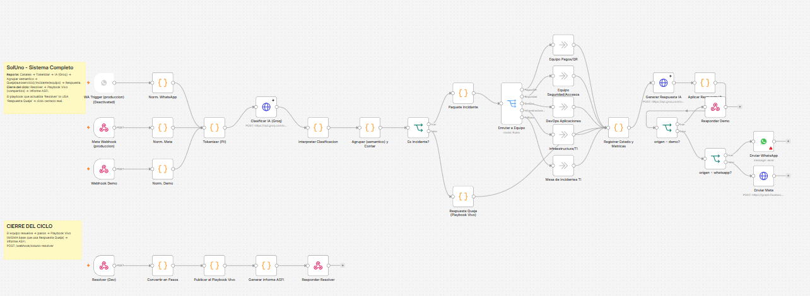
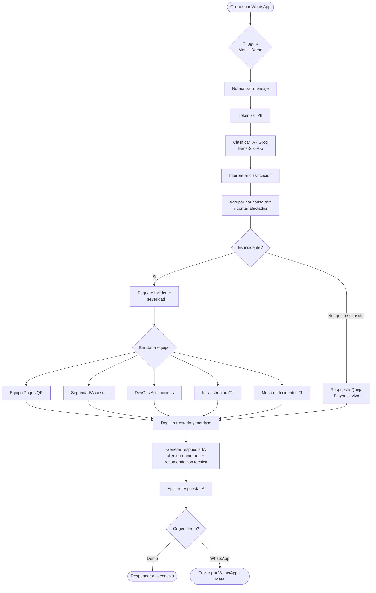

# SolUno · Centro de operaciones de atención con IA — BancoSol

> **InnovaHack 2026.** Gestión inteligente de **quejas e incidencias** de BancoSol por WhatsApp, con un agente de IA que **resuelve las quejas de forma autónoma** y **deriva las incidencias al equipo de TI correcto**, todo orquestado con **n8n** y visible en tiempo real en una consola para el equipo de soporte.

---

## 🔗 Accesos rápidos (para los jurados)

| | Link |
|---|---|
| 🖥️ **Probar la APP EN VIVO** (entrá como si fueras el técnico de soporte) | **https://security-affair-untrimmed.ngrok-free.dev** |
| 🔁 **Workflow de n8n** (flujo de automatización, con diagrama) | [SolUno_n8n_sistema.json](SolUno_n8n_sistema.json) · ver [diagrama](#-workflow-de-n8n-flujo-de-automatización) |
| 📄 **Informe del proyecto** (PDF / Word) | [SolUno_Informe.pdf](SolUno_Informe.pdf) · [SolUno_Informe.docx](SolUno_Informe.docx) |
| 📦 **Código y documentación** (este repositorio) | https://github.com/bookcubers2-ux/soluno-bancosol |

> ℹ️ Al abrir la app en vivo, el navegador muestra **una vez** un aviso de ngrok: hacé clic en el botón **"Visit Site"** y entrás a la consola. *(La demo en vivo está disponible durante el período de evaluación, mientras el equipo mantiene el entorno activo.)*

---

## 🎯 El problema

BancoSol recibe un alto volumen de mensajes de clientes por WhatsApp. Hoy se mezclan:
- **Quejas** (casos puntuales con solución conocida: cambio de celular, "pagué y aún figura la deuda", dudas de uso…), y
- **Incidencias** (fallas críticas y generalizadas: QR caído, login caído, app que no carga…).

Atenderlos manualmente es lento, no se prioriza por gravedad, no se sabe a qué equipo derivar cada incidencia, y no queda trazabilidad para reportes (ASFI).

## 💡 La solución — SolUno

Un agente conversacional + una consola de operaciones que, por cada mensaje de WhatsApp:

1. **Clasifica** el mensaje con IA → `queja` · `incidente` · `consulta`.
2. **Resuelve las quejas solo**, respondiendo al cliente con una **solución enumerada paso a paso** (cálida, no rígida).
3. **Deriva las incidencias** al **equipo de TI responsable** (Pagos/QR, Seguridad/Accesos, DevOps Aplicaciones, Infraestructura/TI, Mesa de Incidentes) y las **agrupa por causa raíz** (firma), contando los afectados.
4. **Califica la severidad**: Leve · Medio · Urgente · **Crítico**.
5. **Cataloga** cada incidencia contra un **catálogo de problemas (playbooks)** con código `PRB-###`; si el problema es nuevo, lo **añade automáticamente**.
6. Le muestra al técnico la **solución del playbook desplegada paso a paso** (runbooks profesionales), que puede usar tal cual o personalizar.
7. Al **resolver**: avisa al cliente por WhatsApp, **actualiza el playbook** (manual vivo) y genera un **informe ASFI** editable y aprobable.

---

## 🧩 Arquitectura

```
   Cliente (WhatsApp)
        │  mensaje
        ▼
   Meta WhatsApp Cloud API
        │  webhook (vía ngrok)
        ▼
   Backend Node (app/server.js)  ──►  Consola del operador (app/public/index.html)
        │  proxy                         (bandeja en vivo, incidentes, playbooks, informes ASFI)
        ▼
   n8n (SolUno_n8n_sistema.json)
        │  - Clasificador IA (Groq · llama-3.3-70b)
        │  - Interpretar / agrupar por firma / contar afectados
        │  - Enrutar a equipo · severidad
        │  - Generar respuesta al cliente (enumerada) + recomendación técnica
        ▼
   Respuesta al cliente (WhatsApp)
```

- **Privacidad:** los datos personales se **tokenizan** antes de enviarse a la IA.
- **Sin secretos en el código:** todas las claves se leen de variables de entorno (`$env` en n8n, `process.env` en el backend).

---

## 🔁 Workflow de n8n (flujo de automatización)

📄 **Archivo del workflow:** [`SolUno_n8n_sistema.json`](SolUno_n8n_sistema.json) — se puede **importar en cualquier n8n** (menú *Import from File*) para verlo y ejecutarlo.

### Vista real del workflow en n8n



> Arriba: el flujo principal (clasificación + IA + enrutado a equipos + respuesta). Abajo: el **cierre del ciclo** (resolver → playbook vivo → informe ASFI).

### Diagrama simplificado del flujo



> El workflow `SolUno_n8n_watest.json` se encarga del **envío de mensajes a la WhatsApp Cloud API** (texto, botones, plantillas).

---

## 🗂️ Estructura del repositorio

| Ruta | Qué es |
|---|---|
| `app/server.js` | Backend Node **sin dependencias** (WhatsApp ⇄ n8n ⇄ consola, memoria, playbooks, informes ASFI). |
| `app/public/index.html` | **Consola del operador** (HTML/CSS/JS vanilla, identidad BancoSol). |
| `app/playbooks_detallados.json` | **Runbooks completos** paso a paso de cada problema. |
| `SolUno_n8n_sistema.json` | **Workflow principal de n8n** (clasificación + IA + enrutado). |
| `SolUno_n8n_watest.json` | Workflow de envío a WhatsApp (Meta). |
| `SolUno_Proyecto_Maestro.md` · `SolUno_Banco_de_Datos.md` | Documentación del proyecto. |
| `SolUno_Procedimiento_Completo.docx` | Procedimiento detallado del flujo. |
| `.env.example` | Plantilla de variables de entorno. |

---

## ▶️ Cómo ejecutarlo

### Requisitos
- **Node.js 18+**
- **n8n** (se ejecuta con `npx`, no requiere instalación global)
- (Opcional, para WhatsApp real) **ngrok** + una app de **WhatsApp Cloud API** en Meta

### 1) Configurar variables de entorno
Copiá `.env.example` a `.env` y completá tus claves (Groq es gratis: https://console.groq.com).

### 2) Levantar n8n e importar el workflow
```bash
# Importar y activar el workflow principal
npx n8n import:workflow --input=SolUno_n8n_sistema.json
npx n8n import:workflow --input=SolUno_n8n_watest.json

# Iniciar n8n (con las variables de entorno cargadas)
#   GROQ_API_KEY, WHATSAPP_TOKEN, WA_PHONE_ID
npx n8n start
```
n8n queda en **http://localhost:5678**.

### 3) Levantar el backend + la consola
```bash
node app/server.js
```
Abrí la consola en **http://localhost:3000**.

### 4) (Opcional) Conectar WhatsApp real
```bash
ngrok http 3000 --domain=TU_DOMINIO.ngrok-free.dev
```
En Meta → WhatsApp → Configuración de la API, configurá el webhook:
`https://TU_DOMINIO.ngrok-free.dev/webhook/whatsapp` (token de verificación = `WA_VERIFY_TOKEN`).

> 📱 **Nota para los jurados:** con el **número de prueba** de Meta solo se puede responder a números agregados a la lista de destinatarios (máx. 5). Los números de prueba se agregan desde el panel de Meta. *(El equipo facilitará los teléfonos/números habilitados para la demo.)*

---

## ✨ Funcionalidades destacadas

- **Conversación = una queja**: la charla completa se cuenta como un caso; se cierra cuando el cliente agradece.
- **Respuestas enumeradas paso a paso** al cliente (no rígidas, generadas por IA).
- **Catálogo de problemas `PRB-###`** con auto-alta de problemas nuevos.
- **Runbooks completos** (12–18 pasos) basados en buenas prácticas de la industria (SRE / ITIL), adaptados a banca.
- **Centro de derivación de TI**: árbol de equipos con conteo de incidencias activas por equipo.
- **Severidad** Leve/Medio/Urgente/**Crítico** resaltada.
- **Playbook vivo**: la solución se actualiza al resolver.
- **Informe ASFI** generado, editable y aprobable.
- Diseño con identidad **BancoSol** (paleta morado/naranja, tipografía Google).

---

## 🛠️ Stack

`n8n` · `Node.js (http nativo)` · `Groq API (llama-3.3-70b)` · `WhatsApp Cloud API (Meta)` · `HTML/CSS/JS vanilla` · `ngrok`

---

*Proyecto desarrollado para InnovaHack 2026.*
